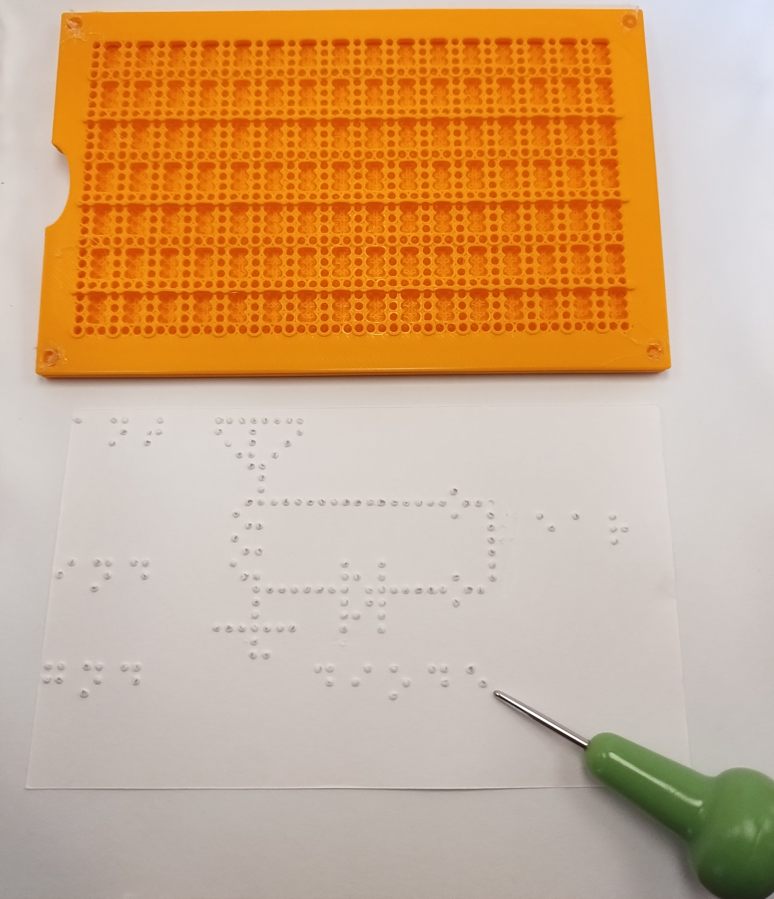
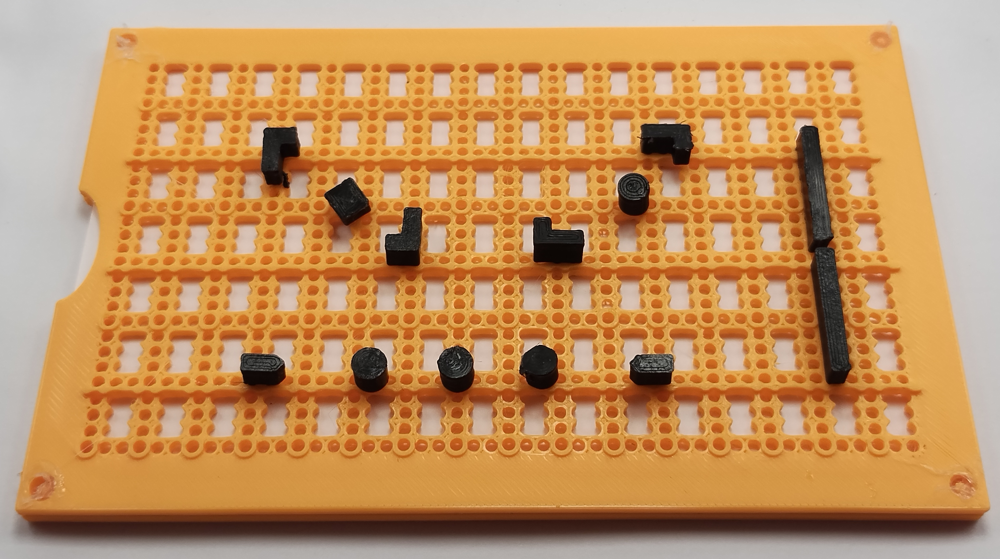

# Pixel Art Slate

The Pixel Art Slate is an experimental tool for creating tactile graphics that can be used by both Blind and sighted people. Inspired by the graphical medium of pixel art, it is a compact 3D printable frame that fits a standard 3x5 index card.

A typical braille slate enables a Blind user to write braille and provides guides for properly spaced characters. This design is simple, portable, and had endured for 200 years. However, it doesn't allow you to create continuous lines of dots because of the blank spaces in between character positions. The Pixel Art Slate extends this basic design; it has the familiar "open" six dot cell positions, but also has a column of single dots that can be embossed between each braille cell. This means you can create unbroken shapes and filled areas of different sizes in addition to braille.

The Pixel Art Slate also has features to help you lay out your drawings and keep track of your location. There is a circular raised bump at the "intersection" of each braille cell position (that is, the dot that is in between both a row of braille and a column of braille). There is a raised ridge between every 2 braille lines, just like a standard slate. And there is a set of 3D printable markers. These markers are small tactile elements with pegs that can be temporarily inserted into the holes of the slate to mark out positions. There are long bar-shaped markers for creating lines and marking out space, and smaller arrow and L-shaped markers. Of course, you can always pull out your drawing-in-progress from the slate to check it and the markers will remain in place.

The slate was designed in OpenSCAD, making it easy to tweak it or create a larger version. See https://github.com/tdeck/tactile-graphics-slate

## Printing

Files are in the prints folder.

Both parts should be printed in their provided orientation. The base should be printed with fine layer heights (e.g. .1mm) so that the hemisphere depressions for each dot will have the right shape. The cover and markers are less sensitive to layer height.

This is a large flat print so warping is a significant concern. You'll need good bed adhesion to print this properly.

PLA works just fine for this print.

I recommend printing a bunch of duplicate markers because they're small and easy to lose, and somewhat fragile. They take almost no plastic and very little time to print.

## Assembly

The slate is designed to be printed in two parts, then permanently joined. There are 4 pegs at each corner of the cover, and 4 corresponding holes in the cover. Once the cover has been placed on these pegs, you should be able to slide in a 3x5 card into the slot on the side. You can permanently join the top and bottom halves with glue around the edges, or by heating up and pressing down the 4 protruding pegs so they form a kind of plastic rivet.

## Code
The code is all in slate.scad and can be adapted for different sizes of slates. I haven't modeled a hinge, but by making the alignment pegs smaller and increasing the clearance the pegs can be made to punch through paper and hold a slate in place. If you want to use the slate this way, disable the card cutout option.
